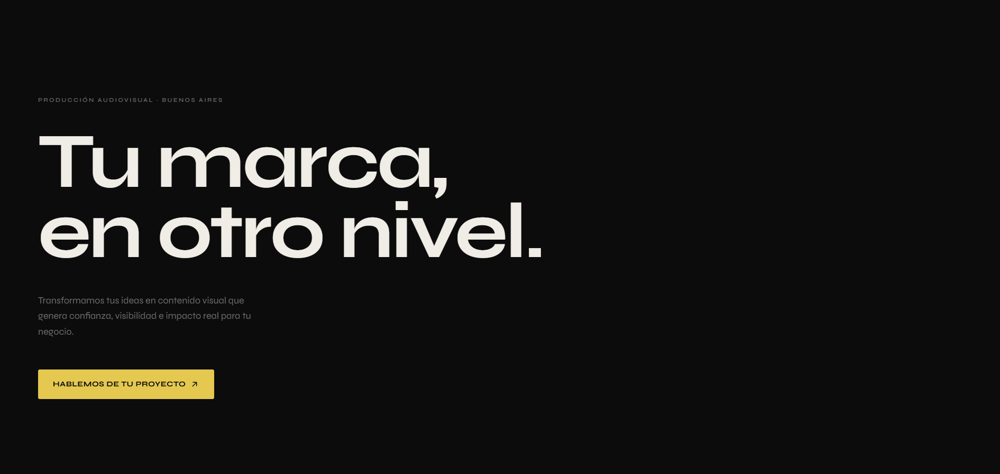

# Prisma Landing Page

Landing page desarrollada como proyecto de práctica para aplicar principios de diseño, copywriting y desarrollo frontend.

El objetivo fue construir una experiencia simple y enfocada en conversión para una productora audiovisual ficticia llamada ****Prisma****.

## Vista previa

## Objetivo

La landing fue diseñada para guiar al usuario hacia una acción principal:

-   Contratar el servicio.

Y acciones secundarias:

-   Contactar por WhatsApp.
-   Solicitar presupuesto.
-   Iniciar una conversación comercial.

## Tecnologías utilizadas

-   HTML5
-   CSS3
-   JavaScript (Vanilla)

## Características

-   Diseño responsive (mobile-first).
-   Hero orientado a conversión.
-   Animaciones suaves mediante Intersection Observer.
-   CTA con microinteracciones.
-   Integración directa con WhatsApp.
-   Accesibilidad básica mediante `prefers-reduced-motion`.
-   Sistema visual minimalista y editorial.

## Decisiones de diseño

### Tipografía

Se evaluaron distintas alternativas (Syne, Inter y Manrope).

Tras pruebas visuales dentro del diseño final, se decidió mantener ****Syne**** como tipografía principal por su personalidad, impacto visual y coherencia con la identidad de la marca.

### Animaciones

Las animaciones se aplican por sección y no por elemento individual.

El objetivo es acompañar el contenido sin distraer al usuario ni afectar el rendimiento.

### Responsive

Se realizaron ajustes específicos para dispositivos de 320px de ancho, corrigiendo un problema de scroll horizontal detectado durante las pruebas.

## Aprendizajes

Durante este proyecto se trabajó especialmente en:

-   Jerarquía tipográfica.
-   Diseño orientado a conversión.
-   Responsive design.
-   Debugging visual.
-   Microinteracciones.
-   Organización de código frontend.
-   Toma de decisiones basada en pruebas visuales.

## Estado del proyecto

✅ MVP completado

Posibles mejoras futuras:

-   Incorporación de portfolio visual.
-   Casos de estudio.
-   Testimonios.
-   Optimización SEO.
-   Despliegue en hosting público.

## Autor

Cristian Lucero

Proyecto realizado como práctica de diseño y desarrollo frontend.
